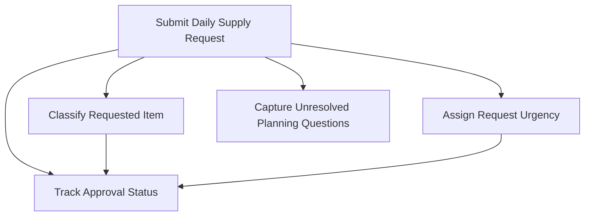

## Invoke Result

- Mode: define
- Spell: invoke
- Canonical ID: invoke
- Scope: library
- Phase status: pass
- Mode contract: arcanum/spells/invoke/define.md
- Outputs: spec artifact embedded below as `mars-habitat-supply-request.module-spec.md`, glossary artifact embedded below as `mars-habitat-supply-request.glossary-ontology.md`, implementation layering seed recorded inline, define transport report embedded below
- Design views: n/a
- Glossary consistency: pass
- Implementation layering: seed emitted inline for L0 define boundary; implementation work remains out of scope
- Work-pack: n/a for define mode; deferred to plan/full
- Template or recipe selection: selected Module Formulae define subset from `arcanum/spells/invoke/templates/module-formulae/` using `module-spec.md` and `glossary-ontology.md`; eligible because the request defines a governed module with concepts, actions, statuses, and unresolved planning questions
- Template selection: Module Formulae module spec plus glossary ontology; no tie case detected
- Decisions: define mode selected from explicit user request; module scope limited to daily supply request capture, category and urgency classification, approval status tracking, and unresolved question capture; architecture, implementation, storage, integration, and operational deployment are excluded
- Unresolved gaps: approver roles, exact item category taxonomy, urgency thresholds, approval workflow states beyond the baseline, habitat inventory integration, offline/degraded behavior, audit-retention policy, notification needs, and reporting requirements remain open for later planning
- Next route: deferred
- Spec artifact evidence: `module-spec.md` template structure applied with mission, ownership boundary, capability map, capabilities, concept model, concept index, relationship map, dependencies, scenarios, decisions, and gaps populated for the Mars habitat supply request module
- Glossary artifact evidence: `glossary-ontology.md` template structure applied with plain-language terms, formal terms, deterministic link statuses, candidate term status, and usage references
- Define transport evidence: bounded define context, selected template evidence, produced artifact list, decisions, unresolved gap ledger, and next-route recommendation are captured in the embedded define transport report
- Next route evidence: downstream architecture/design should wait for approval of this define artifact and resolution or explicit deferral of blocker-grade workflow questions; route remains `deferred` because the user explicitly kept implementation work out of scope

# Primary Define Artifact: Mars Habitat Supply Request Module

```yaml
module: mars-habitat-supply-request
version: current
status: draft
updatedAt: 2026-05-18
docType: module-spec
taskId: invoke-define-live-pass
regime: LIVE-DEFINE-001
mode: define
```

# Mars Habitat Supply Request Module

## Mission

Define a small module that lets Mars habitat operators submit daily supply requests, classify requested items, mark urgency, track approval status, and preserve unresolved planning questions. This artifact establishes the authoring baseline before architecture or implementation work begins.

## Ownership Boundary

- Owns: daily supply request intent capture, requested item classification, urgency marking, approval status tracking, and unresolved question capture for later planning.
- Does Not Own: inventory fulfillment, procurement, habitat logistics execution, storage design, UI design, notification delivery, authentication, authorization, data persistence design, or implementation tasks.

## Capability Map



## Capabilities

| Capability | Outcome | Key Contracts | Detail |
| --- | --- | --- | --- |
| SubmitDailySupplyRequest | Operators can record a daily need for habitat supplies. | Action: SubmitSupplyRequest; Record: SupplyRequest | Captures requester, request date, item name, category, urgency, quantity note, and rationale. |
| ClassifyRequestedItem | Each request has a category suitable for later routing and planning. | Enumeration: SupplyItemCategory | Baseline categories are intentionally provisional until operations confirms taxonomy. |
| AssignRequestUrgency | Operators can communicate operational priority. | Enumeration: RequestUrgency | Baseline urgency values support triage without defining approval SLA rules. |
| TrackApprovalStatus | Each request exposes its current approval state. | Enumeration: ApprovalStatus; Read View: SupplyRequestStatusView | Defines status language only; workflow automation is deferred. |
| CaptureUnresolvedPlanningQuestions | Open questions are preserved with context for later design and planning. | Record: PlanningQuestion | Keeps unclear decisions visible instead of resolving them during define mode. |

## Capability Details

### Submit Daily Supply Request

| Contract Type | Contract Name | Summary |
| --- | --- | --- |
| Action | SubmitSupplyRequest | Creates a draft supply request from operator-provided request details. |
| Read View | DailySupplyRequestList | Lists submitted requests for a habitat day. |
| Policy | SubmissionCompletenessPolicy | Requires enough detail to make a later approval decision possible. |
| Signal | SupplyRequestSubmitted | Indicates that a request has entered the approval-tracking baseline. |

### Classify Requested Item

| Contract Type | Contract Name | Summary |
| --- | --- | --- |
| Enumeration | SupplyItemCategory | Provides provisional request categories. |
| Policy | CategorySelectionPolicy | Requires one category per request and allows `other` when taxonomy is incomplete. |

### Assign Request Urgency

| Contract Type | Contract Name | Summary |
| --- | --- | --- |
| Enumeration | RequestUrgency | Provides baseline urgency labels. |
| Policy | UrgencySelectionPolicy | Requires one urgency per request without defining service-level commitments. |

### Track Approval Status

| Contract Type | Contract Name | Summary |
| --- | --- | --- |
| Enumeration | ApprovalStatus | Defines baseline states for request approval tracking. |
| Read View | SupplyRequestStatusView | Shows request identity, item, urgency, category, and current approval status. |
| Flow | ApprovalStatusTrackingFlow | Describes status movement at a concept level only. |

### Capture Unresolved Planning Questions

| Contract Type | Contract Name | Summary |
| --- | --- | --- |
| Record | PlanningQuestion | Captures unknowns that must be resolved later. |
| Action | AddPlanningQuestion | Adds a question tied to a request, capability, or module-level concern. |
| Read View | OpenPlanningQuestionList | Lists unresolved questions for architecture and planning follow-up. |

## Concept Model

| Concept | Type | Key Constraints |
| --- | --- | --- |
| SupplyRequest | Record | Must have a stable request ID, request date, requester label, item description, category, urgency, and approval status. |
| SupplyRequestItem | Value Type | Describes the requested supply item in operator language; exact catalog linking is deferred. |
| SupplyItemCategory | Enumeration | Baseline values: `life-support`, `medical`, `food-water`, `maintenance`, `science`, `personal`, `other`. |
| RequestUrgency | Enumeration | Baseline values: `routine`, `important`, `critical`. |
| ApprovalStatus | Enumeration | Baseline values: `draft`, `submitted`, `under-review`, `approved`, `rejected`, `deferred`. |
| PlanningQuestion | Record | Must include question text, source context, owner if known, status, and target follow-up phase. |
| HabitatDay | Value Type | Represents the local operations day for grouping daily requests; exact Mars sol/calendar handling is deferred. |

## Concept Index

| Concept | ID | Type | Source |
| --- | --- | --- | --- |
| SupplyRequest | mars-habitat-supply-request.SupplyRequest | Record | module-spec |
| SupplyRequestItem | mars-habitat-supply-request.SupplyRequestItem | Value Type | module-spec |
| SupplyItemCategory | mars-habitat-supply-request.SupplyItemCategory | Enumeration | module-spec |
| RequestUrgency | mars-habitat-supply-request.RequestUrgency | Enumeration | module-spec |
| ApprovalStatus | mars-habitat-supply-request.ApprovalStatus | Enumeration | module-spec |
| PlanningQuestion | mars-habitat-supply-request.PlanningQuestion | Record | module-spec |
| HabitatDay | mars-habitat-supply-request.HabitatDay | Value Type | module-spec |
| SubmitSupplyRequest | mars-habitat-supply-request.SubmitSupplyRequest | Action | module-spec |
| AddPlanningQuestion | mars-habitat-supply-request.AddPlanningQuestion | Action | module-spec |
| DailySupplyRequestList | mars-habitat-supply-request.DailySupplyRequestList | Read View | module-spec |
| SupplyRequestStatusView | mars-habitat-supply-request.SupplyRequestStatusView | Read View | module-spec |
| OpenPlanningQuestionList | mars-habitat-supply-request.OpenPlanningQuestionList | Read View | module-spec |

## Relationship Map

| From | Edge | To | Evidence | Notes |
| --- | --- | --- | --- | --- |
| mars-habitat-supply-request.SubmitSupplyRequest | creates | mars-habitat-supply-request.SupplyRequest | User request: operators submit daily supply requests | Creation behavior is conceptual only. |
| mars-habitat-supply-request.SupplyRequest | includes | mars-habitat-supply-request.SupplyRequestItem | User request: identify item category | Catalog integration is deferred. |
| mars-habitat-supply-request.SupplyRequest | classified_by | mars-habitat-supply-request.SupplyItemCategory | User request: identify item category | Category list is provisional. |
| mars-habitat-supply-request.SupplyRequest | prioritized_by | mars-habitat-supply-request.RequestUrgency | User request: identify urgency | Urgency does not imply SLA yet. |
| mars-habitat-supply-request.SupplyRequest | tracked_by | mars-habitat-supply-request.ApprovalStatus | User request: track approval status | Approval authority is unresolved. |
| mars-habitat-supply-request.AddPlanningQuestion | creates | mars-habitat-supply-request.PlanningQuestion | User request: leave unresolved questions for later planning | Keeps design concerns visible. |
| mars-habitat-supply-request.OpenPlanningQuestionList | reads | mars-habitat-supply-request.PlanningQuestion | Define-mode governance rule: record unresolved gaps | Used for downstream architecture readiness. |

## Baseline Request Fields

| Field | Required | Purpose | Notes |
| --- | --- | --- | --- |
| Request ID | yes | Stable reference for review and follow-up. | Generation strategy deferred. |
| Habitat day | yes | Groups requests into daily operations. | Mars calendar convention unresolved. |
| Requester label | yes | Identifies the operator or station role making the request. | Identity model deferred. |
| Item description | yes | Describes the requested supply in operator language. | Catalog matching deferred. |
| Category | yes | Supports triage and later routing. | Provisional category taxonomy. |
| Urgency | yes | Communicates operational priority. | SLA and escalation behavior deferred. |
| Quantity note | optional | Captures amount, unit, or free-text sizing. | Unit normalization deferred. |
| Rationale | optional | Explains why the supply is needed. | May become required for high urgency later. |
| Approval status | yes | Shows current review state. | Default proposed state: `draft` or `submitted`, pending workflow choice. |
| Unresolved questions | optional | Captures planning unknowns tied to the request. | May also exist at module level. |

## Approval Status Baseline

| Status | Meaning | Notes |
| --- | --- | --- |
| draft | Request is being prepared and is not ready for review. | Whether draft state is needed is unresolved. |
| submitted | Request is ready for approval review. | Baseline entry point if drafts are skipped. |
| under-review | Request is being evaluated by an approver. | Approver role unresolved. |
| approved | Request is accepted for later fulfillment planning. | Fulfillment is outside this module. |
| rejected | Request is not accepted. | Rejection reason policy unresolved. |
| deferred | Request cannot be decided yet. | Should link to planning question or missing information. |

## Supporting Contracts

| Contract Document | Purpose |
| --- | --- |
| mars-habitat-supply-request.module-spec.md | Canonical module definition and capability boundary. |
| mars-habitat-supply-request.glossary-ontology.md | Terminology authority for this define artifact. |
| future concept-model.md | Deferred structural model for records, values, and enumerations. |
| future operations.md | Deferred action and read-view contract. |
| future flows-policies.md | Deferred approval flow and policy contract. |
| future interfaces.md | Deferred integration and API boundary contract. |
| future architecture-bundle.md | Deferred architecture/design artifact after define approval. |
| future implementation-plan.md | Deferred implementation planning; out of scope for this request. |

## External Dependencies

| Capability | Depends On | Via | Why |
| --- | --- | --- | --- |
| SubmitDailySupplyRequest | Habitat operator identity source | requester label | Needed to identify who submitted the request; exact auth model deferred. |
| ClassifyRequestedItem | Supply taxonomy or inventory catalog | category selection | Needed for precise categories; current taxonomy is provisional. |
| TrackApprovalStatus | Approval authority or review process | status transition | Needed to determine who can approve and when. |

## Provides To

| Consumer | Consumes Capability | Via | Delivered Value |
| --- | --- | --- | --- |
| Future architecture work | Defined module boundary and concepts | module-spec | Clear scope before design decisions. |
| Future implementation planning | Capability and gap baseline | concept index and unresolved gaps | Prevents implementation from absorbing unknown requirements silently. |
| Habitat operations stakeholders | Shared request language | glossary | Aligns operator and planner terminology. |

## Scenario Coverage

| Scenario | Define-Level Acceptance |
| --- | --- |
| Operator submits a daily request for a replacement air filter. | Request can capture item description, maintenance category, urgency, and submitted status. |
| Operator submits a critical medical supply request. | Request can capture medical category and critical urgency without defining escalation automation. |
| Approver has not yet decided on a request. | Request can show `under-review` or `deferred` status. |
| Team does not know whether food and water should be one category or two. | Question is recorded as an unresolved planning question instead of being silently resolved. |

## Define Decisions

| Decision | Outcome | Rationale |
| --- | --- | --- |
| Mode boundary | Define only | User explicitly requested definition before architecture and excluded implementation work. |
| Module type | Small operational request module | Request centers on a bounded workflow and status tracking. |
| Template family | Module Formulae | Fits concept-first governed module definition with glossary support. |
| Category taxonomy | Provisional baseline | Needed for usable definition, but exact habitat taxonomy is unresolved. |
| Urgency taxonomy | `routine`, `important`, `critical` | Small enough for define-stage clarity without implying SLA rules. |
| Approval statuses | Baseline conceptual states | Supports tracking while leaving workflow design for later. |
| Planning questions | First-class module concept | User explicitly requested unresolved questions for later planning. |

## Unresolved Gaps

| Gap | Why It Matters | Recommended Follow-Up |
| --- | --- | --- |
| Who approves requests? | Approval status cannot become enforceable without authority rules. | Resolve during design interview. |
| What item categories are canonical? | Category values affect routing, reporting, and possible inventory integration. | Confirm with habitat operations stakeholders. |
| What urgency rules apply? | Urgency may imply escalation, review order, or required rationale. | Decide before architecture flow design. |
| Is draft status required? | Draft support affects UX, persistence, and workflow complexity. | Decide during design. |
| What is the Mars day convention? | Daily grouping depends on sol/calendar handling. | Define with mission operations context. |
| Should requests link to inventory catalog items? | Catalog linking changes validation and interfaces. | Defer to architecture after scope approval. |
| Are notifications needed? | Notifications affect downstream integration and workflow design. | Defer until approval process is known. |
| What audit history is required? | Status tracking may require change history and retention rules. | Resolve before implementation planning. |
| Can requests be edited after submission? | Edit policy affects state transitions and audit needs. | Resolve in design. |

## Implementation Layering Seed

| Layer | Decision Question | Minimum Working Unit | Included Scope | Deferred Scope | Exit Evidence | Promotion Decision |
| --- | --- | --- | --- | --- | --- | --- |
| L0 | After this layer, we know whether the request concept and approval-status language are accepted by stakeholders. | Approved define artifact with module boundary, concepts, glossary, and gap ledger. | Definition only: request fields, categories, urgency, statuses, and unresolved questions. | Architecture, UI, storage, integrations, implementation, testing, deployment. | Stakeholder approval of define artifact and explicit disposition of blocker gaps. | Move to design, revise definition, or stop. |

# Companion Glossary Artifact: Mars Habitat Supply Request Module

```yaml
module: mars-habitat-supply-request
version: current
status: draft
updatedAt: 2026-05-18
docType: glossary-ontology
```

# Glossary And Ontology: Mars Habitat Supply Request Module

## Plain Language Terms

| Term | Meaning In This Module | Related Concepts |
| --- | --- | --- |
| Daily supply request | A request made by a habitat operator for supplies needed during a habitat operations day. | SupplyRequest, HabitatDay |
| Item category | A provisional grouping for the requested supply, used for triage and later planning. | SupplyItemCategory |
| Urgency | The operator's declared priority for the request. | RequestUrgency |
| Approval status | The current review state of a supply request. | ApprovalStatus |
| Unresolved question | A known unknown that should be preserved for later architecture or planning work. | PlanningQuestion |

## Formal Terms

| Term | Category | Definition | Source Or Rationale | Linked Authority Concepts | Link Status | No Match Reason | Usage References | Status | Created At | Updated At |
| --- | --- | --- | --- | --- | --- | --- | --- | --- | --- | --- |
| SupplyRequest | business | A daily operator-submitted record describing a needed habitat supply and its review state. | Derived from user request. | mars-habitat-supply-request.SupplyRequest | linked | n/a | Mission, Capabilities, Concept Model | candidate | 2026-05-18 | 2026-05-18 |
| SupplyRequestItem | business | The operator-described supply being requested. | Derived from item-identification requirement. | mars-habitat-supply-request.SupplyRequestItem | linked | n/a | Baseline Request Fields | candidate | 2026-05-18 | 2026-05-18 |
| SupplyItemCategory | business | A controlled category assigned to a requested supply item. | Derived from category requirement. | mars-habitat-supply-request.SupplyItemCategory | linked | n/a | Concept Model, Baseline Request Fields | candidate | 2026-05-18 | 2026-05-18 |
| RequestUrgency | business | A controlled priority label assigned by the operator to indicate request importance. | Derived from urgency requirement. | mars-habitat-supply-request.RequestUrgency | linked | n/a | Concept Model, Baseline Request Fields | candidate | 2026-05-18 | 2026-05-18 |
| ApprovalStatus | business | A controlled state indicating where a supply request is in review. | Derived from approval tracking requirement. | mars-habitat-supply-request.ApprovalStatus | linked | n/a | Approval Status Baseline | candidate | 2026-05-18 | 2026-05-18 |
| PlanningQuestion | system | A captured unresolved question with enough context for later design or planning follow-up. | Derived from unresolved-question requirement. | mars-habitat-supply-request.PlanningQuestion | linked | n/a | Unresolved Gaps, Capability Details | candidate | 2026-05-18 | 2026-05-18 |
| HabitatDay | business | The operational day used to group supply requests. | Needed to interpret daily request behavior. | mars-habitat-supply-request.HabitatDay | partial | Exact Mars sol/calendar authority not selected. | Baseline Request Fields, Unresolved Gaps | candidate | 2026-05-18 | 2026-05-18 |
| Approver | business | A person, role, or process that can decide whether a request is approved. | Needed for approval tracking but not defined by user request. | n/a | no-match | Approval authority is unresolved. | External Dependencies, Unresolved Gaps | candidate | 2026-05-18 | 2026-05-18 |

## External Terms

| Term | Source Scope | Definition In This Module | Source Reference |
| --- | --- | --- | --- |
| Mars habitat | Mission operations context | The operational environment where supply requests are submitted and reviewed. | User request |
| Inventory catalog | Future external system | A possible source of canonical supply items and categories. | Deferred dependency |
| Habitat operator | Mission operations role | The person or role submitting daily supply requests. | User request |

## Maintenance Rules

- Treat this glossary as the terminology source for the define artifact.
- Keep category and link status values deterministic: `linked`, `partial`, or `no-match`.
- Keep all candidate terms unpromoted until reviewed.
- Do not add implementation behavior through glossary changes.
- Update usage references when downstream design artifacts are created.

# Define Transport Report

```yaml
taskId: invoke-define-live-pass
regime: LIVE-DEFINE-001
spell: invoke
mode: define
phaseStatus: pass
transportStatus: ready-for-review
updatedAt: 2026-05-18
```

## Bounded Define Context

The request is to define a small Mars habitat supply request module before architecture work begins. The usable intent includes daily operator submissions, item category, urgency, approval status tracking, and unresolved questions. The explicit exclusion is implementation work.

## Template Evidence

| Evidence Item | Result |
| --- | --- |
| Template inventory checked | `arcanum/spells/invoke/templates/module-formulae/` |
| Selected spec template | `module-spec.md` |
| Selected glossary template | `glossary-ontology.md` |
| Selection rationale | Concept-first governed module with glossary and handoff needs. |
| Tie case | None detected. |
| Candidate-template gap | None required for this define output. |

## Artifact Evidence

| Artifact | Evidence |
| --- | --- |
| Spec artifact | Primary define artifact includes mission, ownership boundary, capability map, concept model, concept index, relationship map, scenarios, decisions, and unresolved gaps. |
| Glossary artifact | Companion glossary includes plain-language terms, formal terms, link statuses, source rationale, and candidate promotion status. |
| Implementation layering seed | L0 seed emitted to keep implementation out of scope while preserving next-layer decision evidence. |
| Work-pack | Not emitted in define mode. |

## Decision Ledger

| Decision | Status |
| --- | --- |
| Define mode is the correct mode. | Accepted. |
| Module scope is limited to request capture and status tracking. | Accepted. |
| Implementation work is out of scope. | Accepted. |
| Architecture work is deferred until define approval. | Accepted. |
| Categories, urgency, and statuses are provisional baselines. | Accepted with follow-up gaps. |

## Gap Ledger

| Gap | Status | Route |
| --- | --- | --- |
| Approver role and authority | unresolved | design follow-up |
| Canonical item category taxonomy | unresolved | design follow-up |
| Urgency thresholds and escalation meaning | unresolved | design follow-up |
| Exact approval workflow transitions | unresolved | design follow-up |
| Mars day/calendar convention | unresolved | design follow-up |
| Inventory/catalog integration | unresolved | architecture follow-up |
| Notification requirements | unresolved | architecture follow-up |
| Audit and retention policy | unresolved | planning follow-up |
| Edit-after-submit policy | unresolved | design follow-up |

## Next Route Evidence

The next route is `deferred`. The define artifact is ready for user review, but architecture/design should not start until the module boundary, glossary terms, and provisional taxonomies are approved or revised. Implementation planning remains explicitly out of scope.