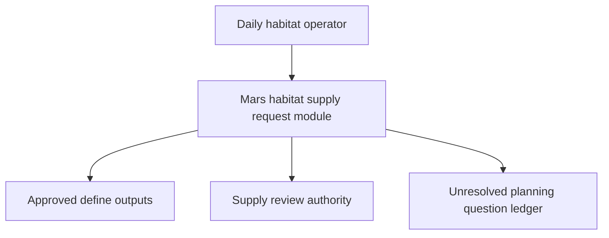
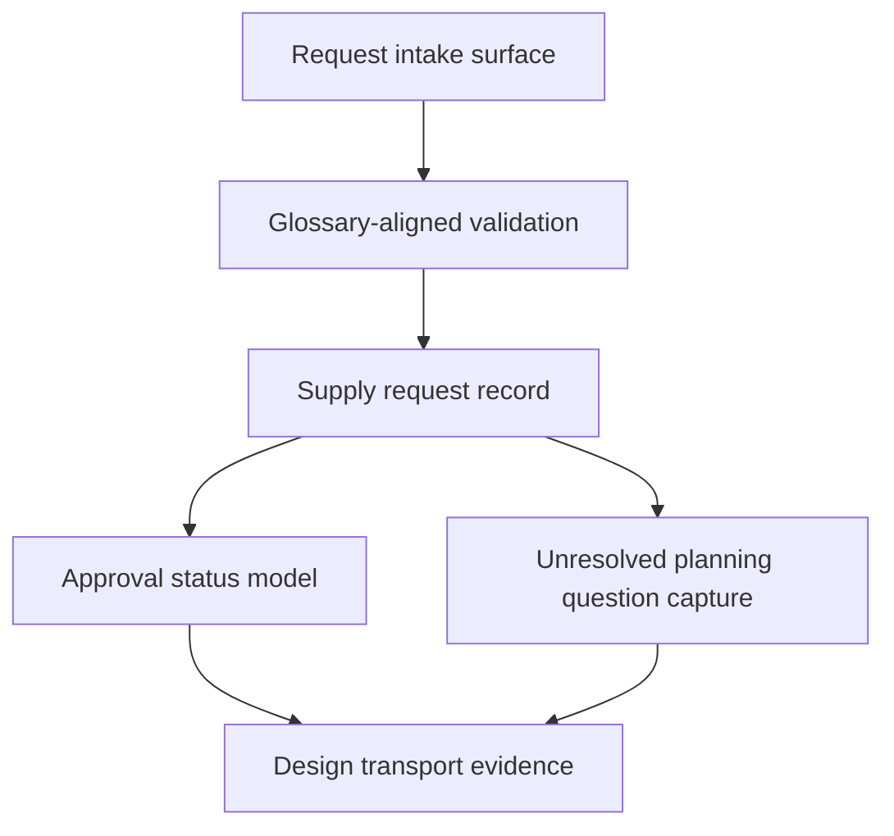
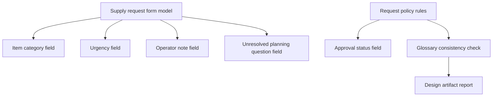
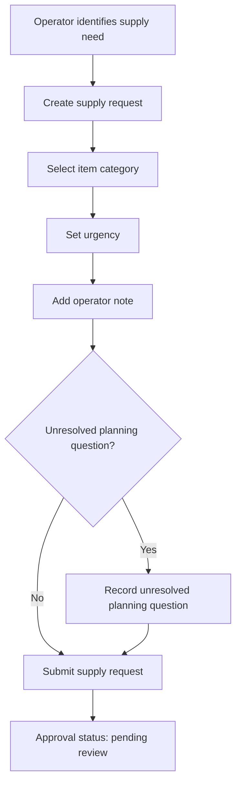
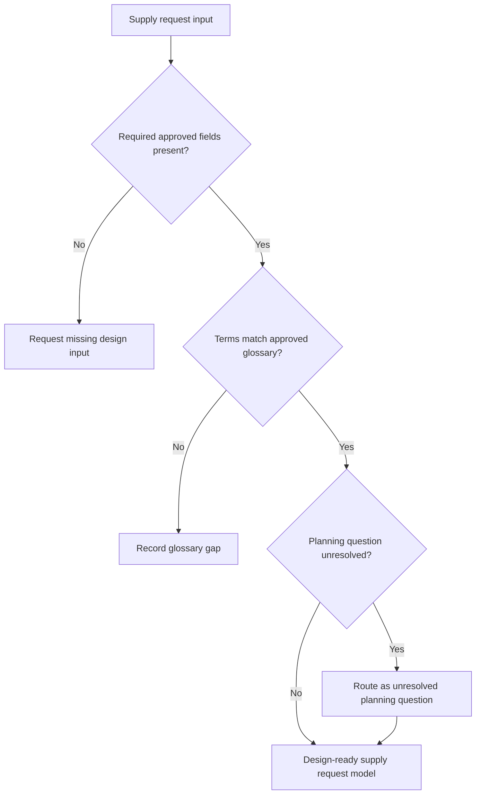
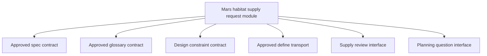

## Invoke Result

- Mode: design
- Spell: invoke
- Canonical ID: invoke
- Scope: library
- Phase status: pass
- Mode contract: `arcanum/spells/invoke/design.md`
- Outputs: `arcanum/spells/invoke/development/example-outputs/invoke-design-live-pass.output.md`, architecture plan: n/a, glossary consistency report: included inline, transport report: included inline
- Design views: context | high-level structure | low-level components | workflow process | decision flow | dependency interface
- Glossary consistency: pass
- Implementation layering: seed emitted inline
- Work-pack: n/a
- Template/profile selection: Module Formulae architecture profile selected because approved define outputs are present and the requested output is a governed design artifact with six required views; no tie case was present
- Source contracts: approved spec, approved glossary, design constraint, and approved design transport contract were supplied by the invocation
- Decisions: design remains non-mutating; module boundary covers supply request intake, categorization, urgency capture, approval status tracking, operator notes, and unresolved planning question capture; downstream implementation tasks are explicitly out of scope
- Unresolved gaps: none blocking; unresolved planning question is represented as a governed domain concept and artifact field, not hidden or promoted into implementation work
- Design transport evidence: define outputs are approved for design consumption; design output is returned as markdown for outer-runner capture; no upstream or downstream spell/sigil contracts are mutated
- Next route: plan
- Next route evidence: design artifact contains six-view coverage, source contracts, glossary consistency, dependency/interface notes, risks, and planning handoff boundaries suitable for a future plan-mode activation

# Mars Habitat Supply Request Module Design

## Design Intent

Design a Mars habitat supply request module that lets daily habitat operators submit governed supply requests using approved define outputs. The module captures item category, urgency, approval status, operator note, and unresolved planning question while preserving the design-mode constraint that no implementation tasks or downstream spell/sigil contract mutations are created.

## Source Contracts

| Contract Type | Approved Source |
| --- | --- |
| Spec | Daily habitat operators submit supply requests with item category, urgency, approval status, and operator notes. |
| Glossary | supply request, item category, urgency, approval status, operator note, unresolved planning question. |
| Constraint | Design mode must not create implementation tasks or mutate downstream spell/sigil contracts. |
| Transport | Define outputs are approved for design consumption. |

## Glossary Consistency

| Term | Design Usage | Status |
| --- | --- | --- |
| supply request | Primary domain record submitted by a habitat operator to request habitat supplies. | pass |
| item category | Classification assigned to the requested supply item. | pass |
| urgency | Priority signal used to guide review and approval attention. | pass |
| approval status | Governed state showing whether the supply request is pending, approved, rejected, or otherwise awaiting review. | pass |
| operator note | Free-form explanatory note supplied by the habitat operator. | pass |
| unresolved planning question | Explicitly captured open question that must be routed forward without being hidden or converted into an implementation task. | pass |

No new glossary terms are promoted. No upstream glossary edits are required.

## View 1: Context View

The module sits between daily habitat operators and the supply review authority. Operators create supply requests; the module preserves approved terminology and exposes unresolved planning questions for future governance.

## View 2: High-Level Structure View

The design separates intake, validation, domain record structure, approval state handling, and transport evidence. This keeps the module governable without defining implementation tasks.

## View 3: Low-Level Components View

Component responsibilities:

| Component | Responsibility |
| --- | --- |
| Supply request form model | Defines the governed information shape for a submitted supply request. |
| Item category field | Captures the approved category classification for the requested supply. |
| Urgency field | Captures the operator’s urgency signal. |
| Approval status field | Represents review state without prescribing workflow implementation. |
| Operator note field | Preserves operator context and rationale. |
| Unresolved planning question field | Captures known planning uncertainty for downstream routing. |
| Glossary consistency check | Confirms all design terms match approved glossary terms. |
| Design artifact report | Carries source contracts, views, risks, and handoff evidence. |

## View 4: Workflow Process View

The workflow defines design-level behavior only. It does not create implementation tasks, execution waves, backlog items, or mutation-ready work packs.

## View 5: Decision Flow View

Decision rules:

| Decision | Rule | Outcome |
| --- | --- | --- |
| Required fields present | Supply request must include item category, urgency, approval status, and operator note. | Missing core design input routes to clarification. |
| Glossary alignment | Design terms must match approved glossary terms. | Conflicts route to gap ledger instead of silent promotion. |
| Planning uncertainty | Open planning uncertainty must remain explicit. | Captured as unresolved planning question. |
| Downstream mutation | Design mode must not mutate spell/sigil contracts. | Any lifecycle work routes to a future authorized mode. |

## View 6: Dependency Interface View

Dependency and interface notes:

| Interface | Direction | Notes |
| --- | --- | --- |
| Approved spec contract | inbound | Defines the allowed module scope. |
| Approved glossary contract | inbound | Defines the only approved terms for this design pass. |
| Design constraint contract | inbound | Prevents implementation planning and downstream contract mutation. |
| Approved define transport | inbound | Establishes that define outputs may be consumed by design. |
| Supply review interface | outbound design boundary | Carries approval status expectations without defining implementation mechanics. |
| Planning question interface | outbound design boundary | Carries unresolved planning questions into future planning or decision routing. |

## Risks

| Risk ID | Risk | Impact | Mitigation |
| --- | --- | --- | --- |
| R-DES-1 | Approval status values are not enumerated in the approved source contracts. | medium | Keep approval status as a governed field and defer exact state enumeration to the next approved route. |
| R-DES-2 | Item category taxonomy is not defined beyond the approved term. | medium | Treat item category as a required classification concept without inventing category values. |
| R-DES-3 | Operator notes may contain operationally sensitive details. | medium | Record sensitivity as a design consideration for future planning without specifying implementation controls. |
| R-DES-4 | Unresolved planning questions could be mistaken for implementation tasks. | high | Preserve them as explicit design gaps and route them forward without work-pack creation. |

## Design Decisions

| Decision | Selected Direction | Evidence |
| --- | --- | --- |
| Module scope | Supply request intake and design-level review state modeling. | Approved spec names daily habitat operator supply requests and required fields. |
| Glossary scope | Use only approved glossary terms. | Invocation provides approved glossary list. |
| Planning uncertainty | Represent unresolved planning question explicitly. | Glossary includes unresolved planning question. |
| Downstream behavior | Route next to plan, but do not create plan tasks. | Design constraint forbids implementation tasks and downstream mutation. |
| Transport | Return markdown artifact for outer-runner capture. | Invocation states the outer runner saves the final response. |

## Implementation Layering Seed

This design suggests a future layering boundary without creating implementation work:

| Layer | Design Boundary |
| --- | --- |
| Interface layer | Operator-facing supply request intake and review-facing status visibility. |
| Application layer | Supply request submission flow and approval status coordination. |
| Core rules layer | Glossary-aligned field requirements and unresolved planning question preservation. |
| Storage/integration layer | Deferred; no persistence or integration design is authorized in this pass. |

## Design Transport Evidence

| Transport Item | Evidence |
| --- | --- |
| Define consumption | Approved source contracts state define outputs are approved for design consumption. |
| Non-mutation | This artifact does not edit upstream spec, glossary, spell contracts, sigil contracts, registries, or Necronomicon context. |
| Design completeness | All six design views are present. |
| Glossary consistency | All approved terms are used consistently; no new terms are promoted. |
| Plan readiness | Dependency/interface notes, risks, design decisions, and unresolved planning question handling are included for future plan-mode use. |

## Next Route Evidence

Recommended next route: `plan`.

Rationale: the design artifact has passed six-view coverage, source contract capture, glossary consistency, dependency/interface mapping, risk identification, and design transport checks. A future plan-mode invocation may convert this approved design into planning artifacts only after plan-mode activation gates are satisfied.