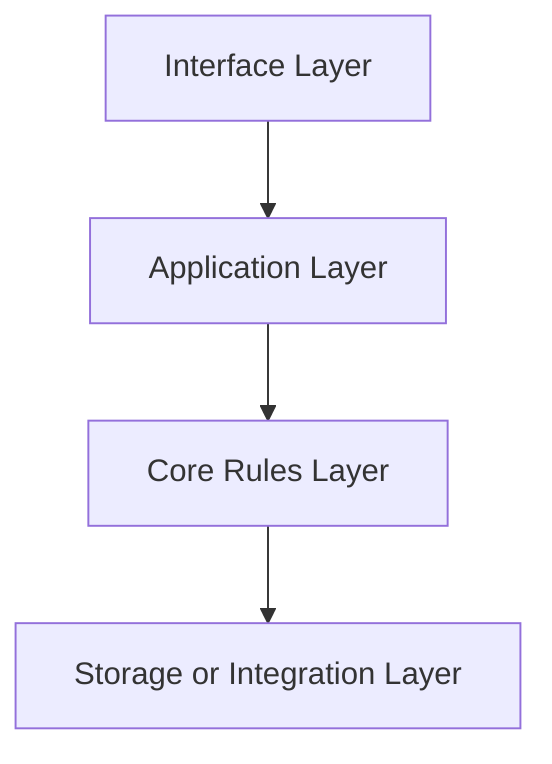
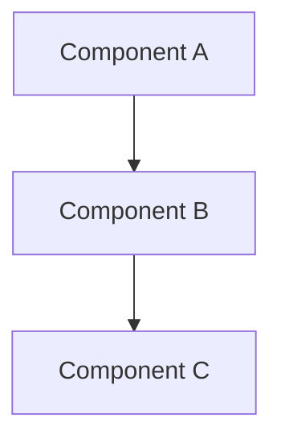
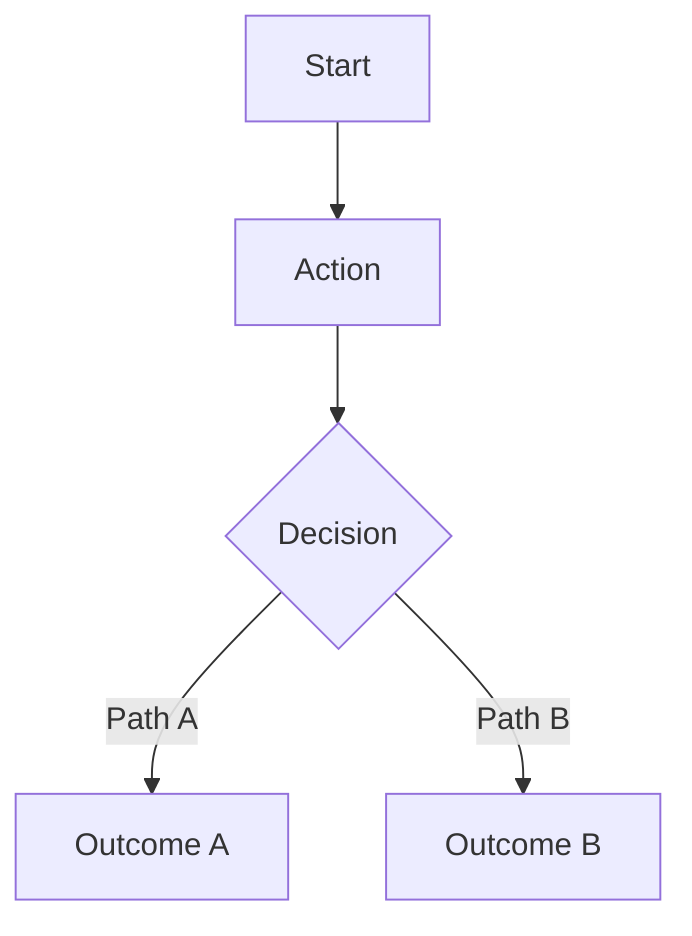
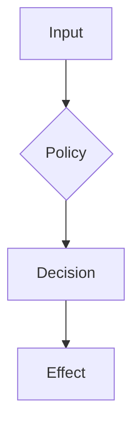
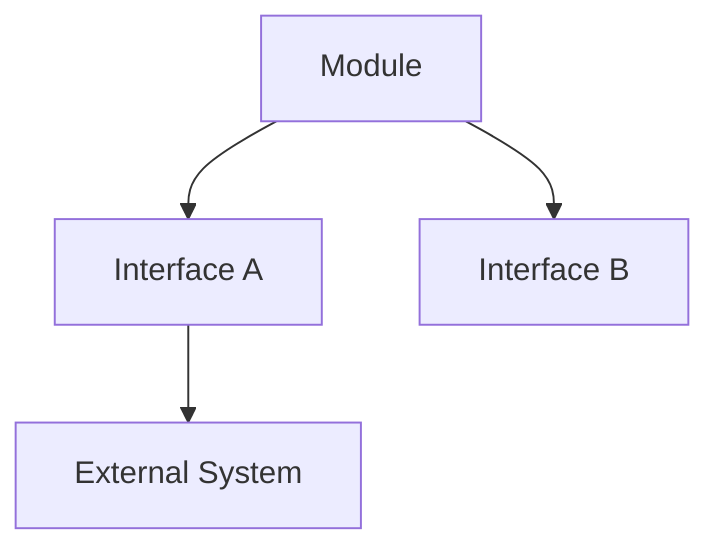

# Architecture Bundle: {Module Name}

Use this template to translate approved module scope into structural and process design views.

## Design Intent

Summarize architecture goals and constraints in two to three sentences.

## Inputs

- [module-spec.md](module-spec.md)
- [glossary-ontology.md](glossary-ontology.md)
- [research-brief.md](research-brief.md) (when available)

## Required View Set

### 1. Context View

```mermaid
graph TD
    User[Actor] --> Module[{Module}]
    Module --> External[External Dependency]
```

### 2. High-Level Structure View



### 3. Low-Level Components View



### 4. Workflow Process View



### 5. Decision Flow View



### 6. Dependency Interface View



## Assumptions

- {assumption 1}
- {assumption 2}

## Open Risks

| Risk ID | Risk | Impact | Mitigation |
| --- | --- | --- | --- |
| R-ARCH-1 | {risk summary} | high, medium, low | {mitigation} |

## Unresolved Decisions

| Decision | Options | Current Status |
| --- | --- | --- |
| {decision summary} | {A, B, C} | open, selected, blocked |

## Planning Notes

- Direct implementation constraints: {constraints}
- Boundary rules: {rules}
- Testability implications: {notes}

## Handoff Targets

- [implementation-plan.md](implementation-plan.md)
- [execution-pack.md](execution-pack.md)
